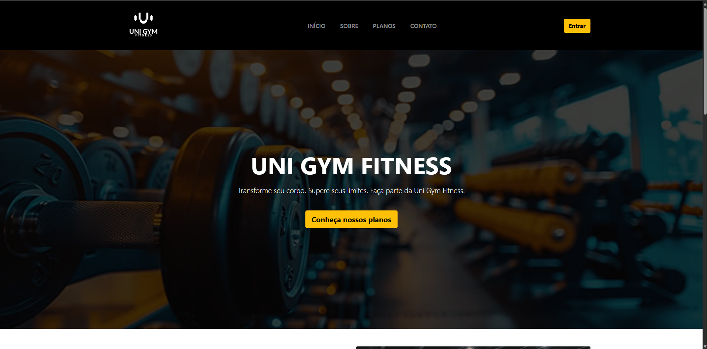
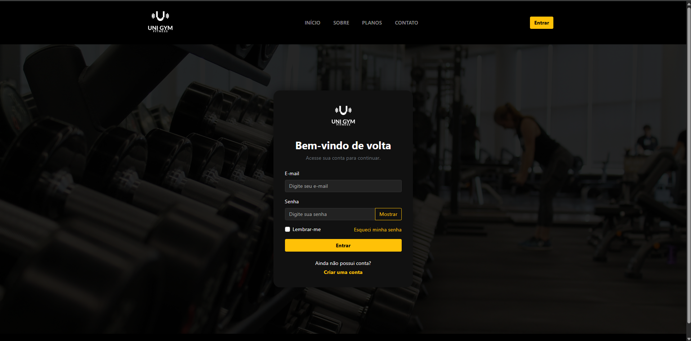
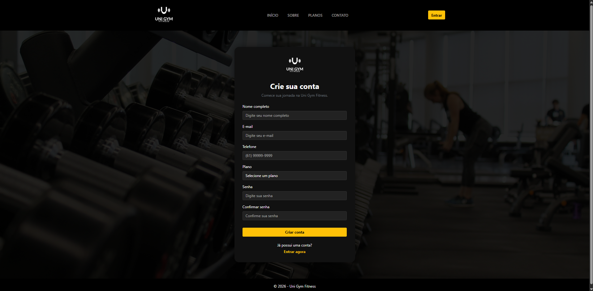
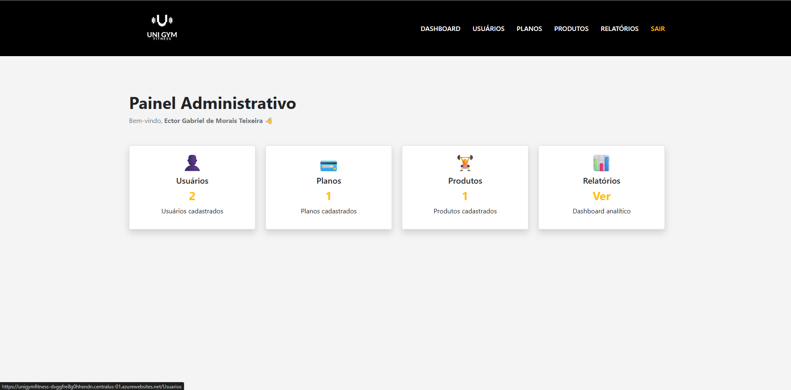

# 🏋️ UniGymFitness

> Sistema web para gerenciamento de academias desenvolvido com **ASP.NET Core MVC (.NET 8)**, **C#**, **Entity Framework Core** e **MySQL**.

<p align="center">

[](https://dotnet.microsoft.com/)


</p>

---

# 🚀 Demonstração

### 🌐 Aplicação Online

**Acesse aqui:**

https://unigymfitness-dvggfre8g0hhendn.centralus-01.azurewebsites.net/

---

# 📖 Sobre o projeto

O **UniGymFitness** é um sistema web desenvolvido para auxiliar na gestão de academias.

O projeto permite o gerenciamento de usuários, planos e produtos através de uma área administrativa completa, além de oferecer autenticação, dashboards e uma interface moderna e responsiva.

Este projeto foi desenvolvido utilizando a arquitetura **MVC**, aplicando boas práticas de organização de código e desenvolvimento de software.

---

# ✨ Funcionalidades

- ✅ Landing Page Responsiva
- ✅ Sistema de Login
- ✅ Cadastro de Usuários
- ✅ Dashboard Administrativo
- ✅ Gerenciamento de Usuários
- ✅ Gerenciamento de Planos
- ✅ Gerenciamento de Produtos
- ✅ Área Administrativa
- ✅ Interface Responsiva

---

# 🛠 Tecnologias Utilizadas

- C#
- ASP.NET Core MVC (.NET 8)
- Entity Framework Core
- MySQL
- HTML5
- CSS3
- JavaScript
- Bootstrap

---

# 🏛 Arquitetura

O projeto foi desenvolvido utilizando o padrão arquitetural **MVC (Model-View-Controller)**.

```
Controllers
Models
Views
Data
Migrations
wwwroot
```

---

# 📷 Screenshots

## 🏠 Página Inicial



---

## 🔐 Login



---

## 👤 Cadastro



---

## 📊 Dashboard Administrativo



---

## 🧑 Área do Aluno


---

## 💳 Planos


---

# 💻 Como executar o projeto

```bash
git clone https://github.com/EctorGabriel09/UniGymFitness.git
```

Depois:

```bash
cd UniGymFitness
```

Configure a conexão com o banco de dados no arquivo:

```text
appsettings.json
```

Depois execute:

```bash
dotnet restore

dotnet ef database update

dotnet run
```

---

# 📈 Próximas melhorias

- Upload de imagens
- Controle financeiro
- Dashboard com gráficos
- API REST
- Responsividade aprimorada
- Testes automatizados

---

# 👨‍💻 Autor

**Ector Gabriel de Morais Teixeira**

- 💼 LinkedIn
  https://www.linkedin.com/in/ector-gabriel/

- 💻 GitHub
  https://github.com/EctorGabriel09

---

## ⭐ Se este projeto foi interessante para você, deixe uma estrela no repositório!
